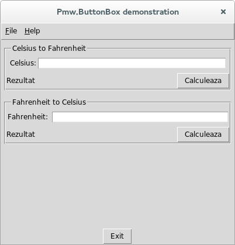

##Convertor Temperatura

Aceasta aplicatie a fost scrisa si rulata pe un sistem **Fedora 21**
cu limbajul de programare **Python 2.7.8** | **Tkinter 8.6.2** | **IDLE 2.7.8** acestea fiind instalate in pachetul de baza al Python.

Suplimentar este necesara instalarea modulului **Pmw 1.3** care poate fi obtinut de la adresa [http://pmw.sourceforge.net/](http://pmw.sourceforge.net/) si poate fi instalat prin utilizarea comenzii:

***
In Ubuntu 14.04 acesta poate fi instalat prin comanda:

    sudo apt-get install python-pmw
***
Pentru instalarea pe sistemul Fedora 21 utilizati comanda:

    sudo yum install python-pmw   
***

