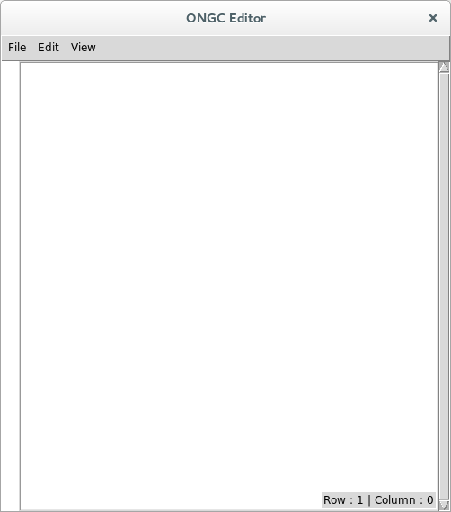

# PmwTkEx
Acest depozit de cod este un exercitiu de utilizare **Pmw(Python megawidgets)** si **Tkinter**. Pentru utilizarea acestei colectii aveti nevoie de limbajul de programare **Python** cu interfata grafica **Tkinter**. De asemenea aveti de instalat si **Pmw** pe care il obtineti de la adresa: [http://pmw.sourceforge.net/](http://pmw.sourceforge.net/) unde aveti si  tutoriale. Acesta poate fi instalat pe platformele Linux, Windows si MacOS.
***
In Ubuntu 14.04 acesta poate fi instalat prin comanda:

    sudo apt-get install python-pmw
***
Pentru instalarea pe sistemul Fedora 21 utilizati comanda:

    sudo yum install python-pmw   
***
In acest depozit de cod aveti descarcat spre utilizare si instalare atat codul sursa **Pmw.1.3.tar.gz** cat si codul dezarhivat in folder-ul **src**.

Fila [BluePrint.py](https://github.com/mhcrnl/PmwTkEx/blob/master/BluePrint.py) este codul care va fi utilizat ca copy/paste pentru toate aceste aplicatii din acest depozit.

In continuare prezentam:
[ConvertorTemperatura ](https://github.com/mhcrnl/PmwTkEx/tree/master/ConvertorTemperatura)

- TextEditor

